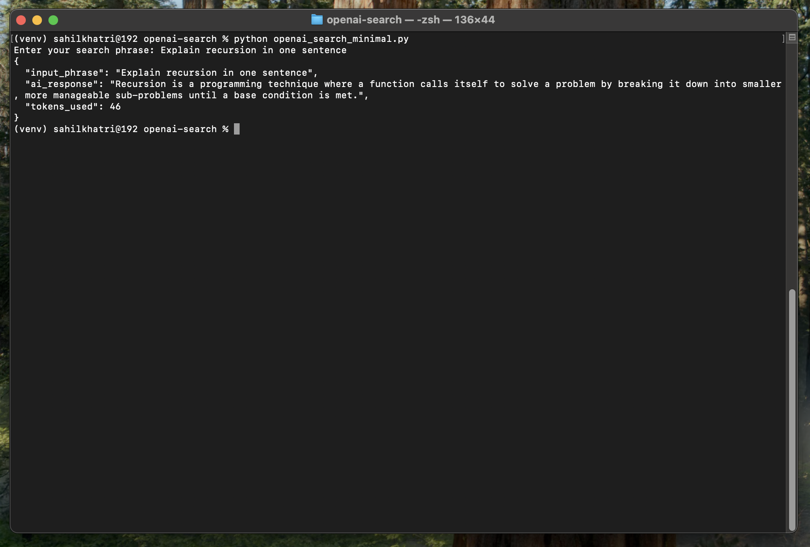
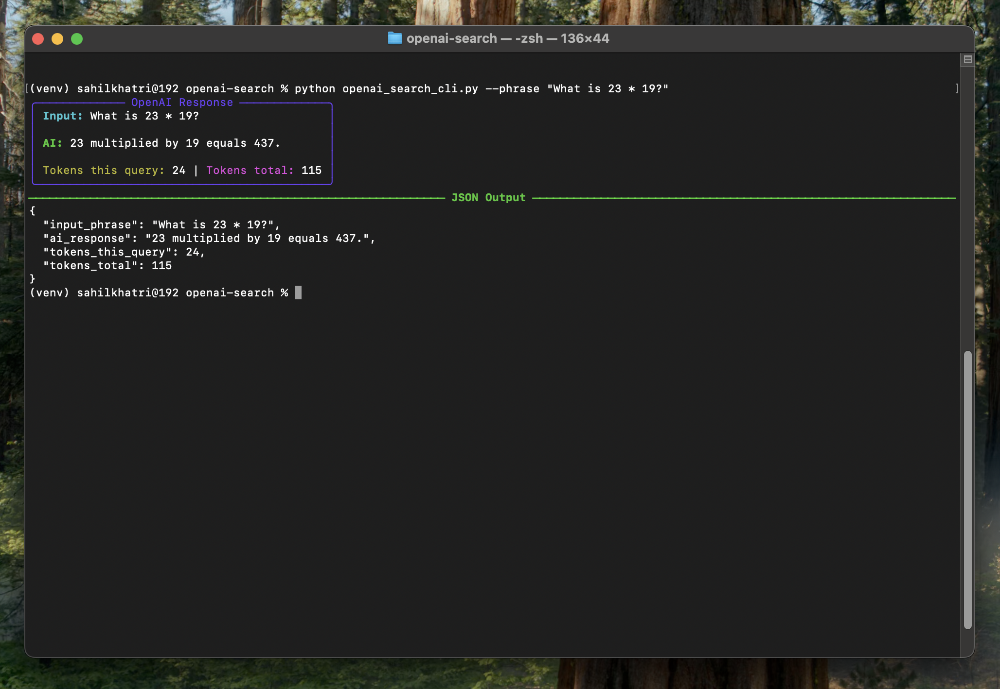

# 🚀 OpenAI Search Scripts

A small Python project demonstrating how to interact with the **OpenAI Chat Completions API**.
It includes both a CLI version (minimal & enhanced) and a deployed App with token logging.

---

## ✨ Features

- Accepts a phrase as input
- Calls the OpenAI Chat Completions API
- Returns a **well-formatted JSON** response
- Enhanced CLI version with:
  - 🎨 Rich-styled terminal panel
  - 📊 Tokens per query + running total
  - 💾 Persists token usage across runs (`token_log.json`)

---

## 📦 Requirements

- Python 3.9+ (tested on 3.12)
- Virtual environment recommended (CLI only)
- OpenAI account + API key

Install dependencies:

```bash
pip install -r requirements.txt
````

-----

### 🔑 Setup API Key

Before running, export your OpenAI API key:

**macOS / Linux:**

```bash
export OPENAI_API_KEY="sk-..."
```

**Windows (PowerShell):**

```powershell
$env:OPENAI_API_KEY="sk-..."
```

-----

## 🚀 Usage 

### 1\. Chat UI (recommended)

A ChatBot-like UI deployed over **Streamlit**. It provides a friendly chat experience, keeps a running token total, stores a local history, and always exposes the final JSON. Best for a quick preview of the project.
<br>
<br>
<br>


<p align="center">
  <a href="https://openai-search-bot.streamlit.app/" target="_blank" rel="noopener noreferrer">
    
  </a>
</p>

<br>

### 2\. Minimal Script (Classic)

```bash
python openai_search_minimal.py
```

**Input:**

```
Enter your search phrase: Explain recursion in one sentence
```

**Output:**




-----

### 3\. CLI Script (Enhanced UI)

```bash
python openai_search_cli.py --phrase "What is 23 * 19?"
```
**Input:**

```
Enter your search phrase: What is 23 * 19?

```

**Output:**


